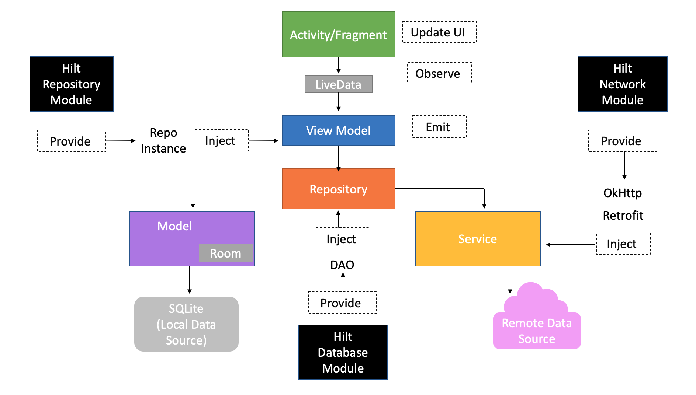
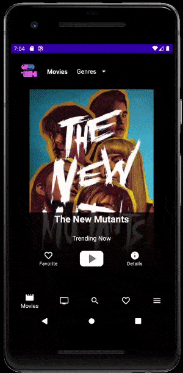

# Capsule Reviews

**Capsule Reviews** is a **Kotlin-based** movie and tv show database application for Android that lets its users to check out currently playing and upcoming titles, browse thousands of movies and tv shows, and create watch lists for your favorite ones.

**Capsule Reviews** uses a combination of **the MovieDB API** and popular **Android Architecture Components** with a clean architecture domain layer to provide a smooth experience for its users.

---

# App Architecture

This project uses the **Model-View-ViewModel architecture pattern**.

- **MMVM Architecture**
- **Repository pattern** for clean domain layer
- **REST API** as Remote Datasource
- **Room** as Local Datasource
- **Dependency injection** with **Hilt**
- **LiveData**

---

# Front-End Features

## Movies List

Displays a glimpse of search results for popular movie endpoints including popular, top-rated, upcoming, etc.

Data is observed in the **LiveData** format by **MoviesListViewModel** and is displayed by the **ListItemAdapter**. Any user interaction over data is handled by **MoviesListFragment.**

### Key features:

- Displays top trending movie as a showcase
- Inserts showcase movie into **local Favorite database**
- Sends an action intent to play showcase movie trailer on **YouTube**
- Displays multiple lists of movies from various endpoints

## Paged Movies List

Displays an endless scrolling list of movies using the **Paging Library** for popular movie endpoints including popular, top-rated, upcoming, etc. along with movies by genre.

Data is observed in the **LiveData** format by **PagedMoviesListViewModel** and is displayed by the **PagedItemAdapter**. Any user interaction over data is handled by **PagedMoviesListFragment.**

### Key features:

- Updates the data by genre
- Provides endless scrolling with paging

## Movie Details

Displays details of a selected movie such as release date, rating, and overview, along with useful links to **the IMDB page** and movie trailer on **YouTube**.

Data is observed in the **LiveData** format by **MovieDetailViewModel** and is displayed by the **MovieDetailFragment**. Any user interaction over data is handled by **MovieDetailFragment**.

### Key features:

- Displays movie details
- Inserts movie into **local Favorite database**
- Shares movie's **IMDB** **page** link
- Sends an action intent to play movie trailer on **YouTube**
- Sends an action intent to display the movie's **IMDB page**
- Displays a list of similar movies

## TV Shows List

Displays a glimpse of search results for trending tv shows for various endpoints and networks.

Data is observed in the **LiveData** format by **TvShowsListViewModel** and is displayed by the **ListItemAdapter**. Any user interaction over data is handled by **TvShowsListFragment.**

### Key features:

- Displays top trending tv show as a showcase
- Inserts showcase tv show into **local Favorite database**
- Sends an action intent to play showcase tv show's trailer on **YouTube**
- Displays multiple lists of tv shows from various endpoints and networks

## Paged TV Shows List

Displays an endless scrolling list of tv shows using the **Paging Library** for trending tv shows endpoints including popular, top-rated, etc. along with tv shows by genre and by a network.

Data is observed in the **LiveData** format by **PagedTvShowsListViewModel** and is displayed by the **PagedItemAdapter**. Any user interaction over data is handled by **PagedTvShowsListFragment.**

### Key features:

- Updates the data by genre
- Updates the data by network
- Provides endless scrolling with paging

## TV Show Details

Displays details of a selected tv show such as release date, rating, and overview, along with useful links to **IMDB page** and tv show trailer on **YouTube**.

Data is observed in the **LiveData** format by **TvShowDetailViewModel** and is displayed by the **TvShowDetailFragment**. Any user interaction over data is handled by **TvShowDetailFragment**.

### Key features:

- Displays tv show details
- Inserts tv show into **local Favorite database**
- Shares tv show's **IMDB** **page** link
- Sends an action intent to play tv show trailer on **YouTube**
- Displays a list of similar tv-shows
- Sends an action intent to display tv show's **IMDB page**

## Search Movies/TV Shows

Takes a keyword input and displays a paged list of search results for movies and tv shows related to the keyword.

Data is observed in the **LiveData** format by **PagedSearchResultsViewModel** and is displayed by the **SearchFragment**. Any user interaction over data is handled by **SearchFragment**.

### Key features:

- Displays a list of search results
- Takes user input as a keyword

## Favorites Lists

Displays lists of favorite movies and tv shows in a **ViewPager**. Allows the user to change the binge status for list items, display details, and remove them from the lists.

Data is observed in the **LiveData** format by **FavoritesViewModel** from the local database and is displayed by the **FavoritesFragment**. Any user interaction over data is handled by their respected fragments.

### Key features:

- Displays a list of favorite movies and tv shows in a tab layout
- Allows updating binge status for list items

## Favorites Details

Displays limited edition of details of favorite movies and tv shows in their respected fragments. Allows checking full details online.

Data is observed in the **LiveData** format by **FavoritesViewModel** from the local database and is displayed by their respected fragments.

### Key features:

- Displays a limited edition of movie/tv show details stored in the local database
- Allows displaying full details online

## ViewModels

**ViewModels** are used prepare and deliver the data they observe from the repository classes to update the UI in **Fragments**. Data is emitted in **LiveData** format so any update to data will also cause the UI counterpart to asyncronously. 

**ViewModels** are also responsible to listen for user interaction and update/manage the data provided by both the local and remote data sources.

---

## Dependency Injection with Hilt

**Hilt** is a **dependency injection library for Android** that reduces the boilerplate of doing manual dependency injection in your project.

Hilt provides a standard way to use DI in your application by providing containers for every Android class in your project and managing their lifecycles automatically. Hilt is built on top of the popular DI library **Dagger** to benefit from the compile-time correctness, runtime performance, scalability, and **Android Studio** support that **Dagger** provides. 

In this project, **Hilt** is used to inject the following depedencies through the application component to the respected classes and interfaces:

 

- **DBModule** provides **DAO** to perform CRUD functions on local database
- **NetworkModule** provides interceptor instances to create an **OkHttp client** and a **Retrofit** instace to **MovieDbService** instance to handle network operations
- **RepositoryModule** provides repository instances the respective **ViewModel** classes

---

# Back-End Features

## Model

Consists of POJOs, getters, and setters.

## Response

**Data classes** that represents **JSON responses** fetched by various the API endpoints.

## FavoritesDAO

Interface consists of method signatures that are used to perform database operations on particular model objects.

## AppDatabase

App database class responsible for creating the local database and providing a singleton instance of it to the app.

## MovieDBService

Interface consists of functions API queries for various endpoints.

## Repositories

Handles network queries and database operations and provides data to respective ViewModels at runtime.

---

# App Navigation

Entire app navigation is handled by the **Navigation Component API**.

---

# Honorable Mentions

I would like to take this opportunity to thank [Brian Munzenberger](https://github.com/bmunzenb) and [Stuart Kent](https://github.com/stkent) for their continued mentorship throughout the project, without their support this project would not be possible!

---

# Legal Disclaimer

**This product uses the TMDb API but is not endorsed or certified by TMDb.**

# **License**

Copyright 2020, The Android Open Source Project

Licensed under the Apache License, Version 2.0 (the "License"); you may not use this file except in compliance with the License. You may obtain a copy of the License at

http://www.apache.org/licenses/LICENSE-2.0

Unless required by applicable law or agreed to in writing, software distributed under the License is distributed on an "AS IS" BASIS, WITHOUT WARRANTIES OR CONDITIONS OF ANY KIND, either express or implied.
See the License for the specific language governing permissions and limitations under the License.
